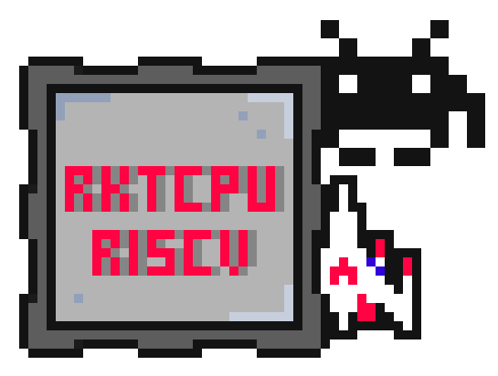

# RKTCPU - RISC V

RktCpu is yet another soft-core RISC-V processor based on the latest rv32ia standard. The goal of this project is to build a processor targeting Xilinx products allowing me to use it in all sorts of future projects. 

## TODO
[X] Finish implementing a pipelined implementation of RV32I that runs simple assembly programs.
[X] Build a data memory model to simulate memory with.
[] Investigate adding AXI4Lite to the design.
[X] Add basic block rams for instruction memory and data memory.
[] Verify on hardware with a blink-led program.
[] Add a debugger bus and debugger.
[] Build a CMake toolset to use for compiling programs for this platform.